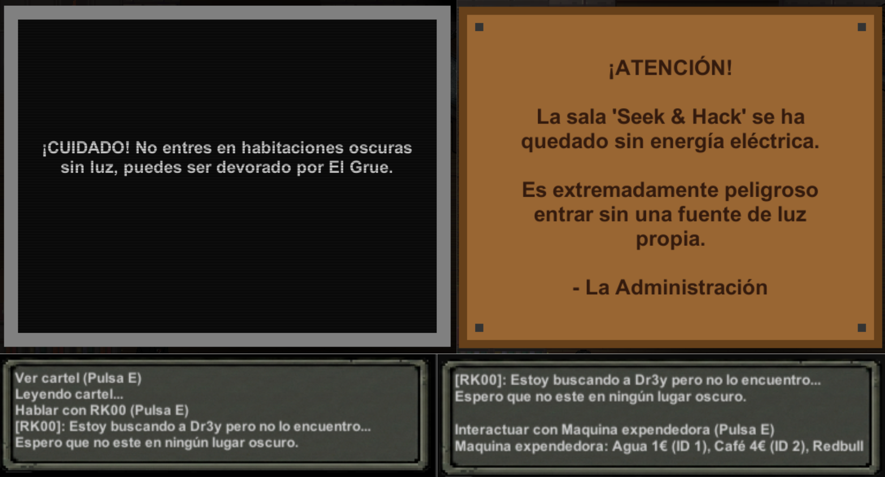
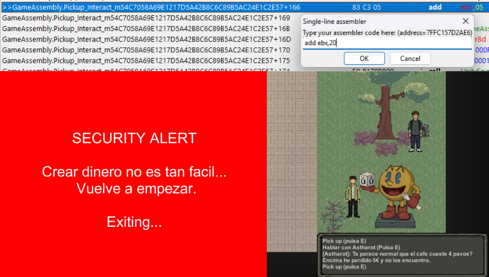
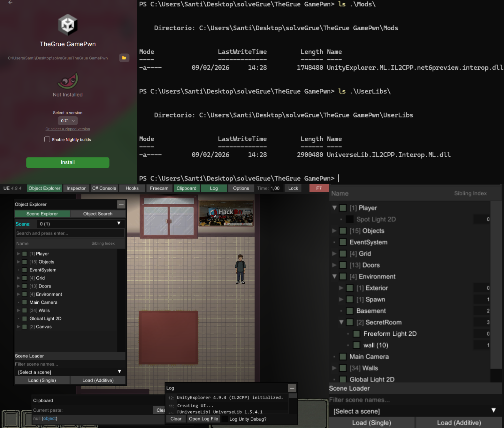
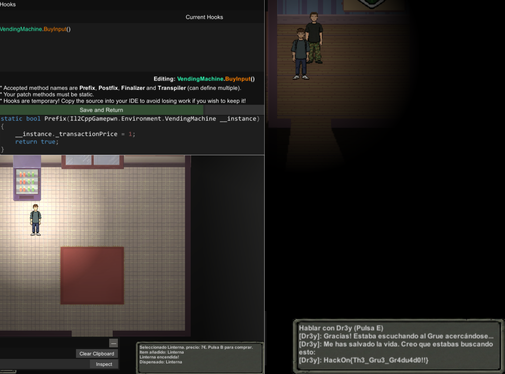
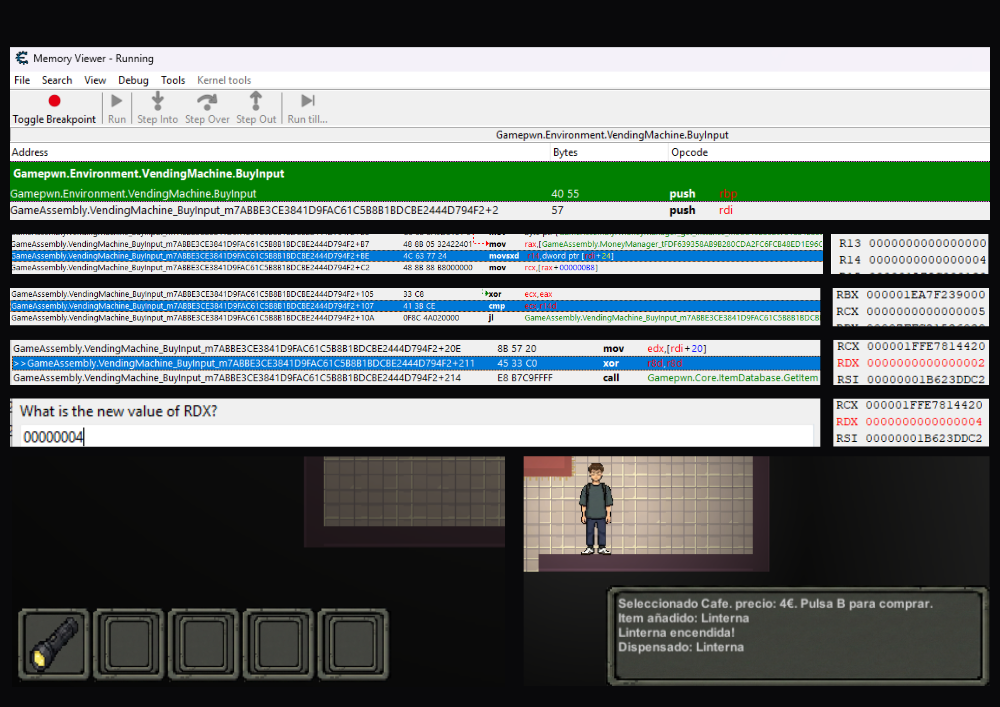

## Introducción

En este post no solo voy a explicar cómo se resuelve el reto, sino que también cómo se desarrolló, qué vulnerabilidades se implementaron y cómo se evitaron soluciones unintended con algunos métodos "anticheat". Si quieres ver solo la solución puedes ir directamente al Writeup.

Al formar parte de la organización del CTF de la HackOn 2026, con la idea de crear retos divertidos y que a la vez enseñen algo nuevo, decidí crear un reto de GamePWN. Me pasé días haciendo retos de HackTheBox y CTFs (especialmente DEFCON) para inspirarme y crear algo que no fuera "típico"

Los vectores comunes que descubrí en los diferentes retos que vi fueron:
- Manipulación de memoria local y comunicaciones cliente-servidor.
- Modificación del código fuente (parcheos).
- Reversing del código (algunas veces ofuscado) para encontrar fallos de lógica.
- Explotación de vulnerabilidades típicas de C/C++ como overflows.

## Idea

La idea principal era crear un reto que jugase con el lore de TheGrue, un monstruo que solo aparece en la oscuridad, por lo que el objetivo era jugar con la iluminación del mapa.
Después de darle una vuelta, se diseñó el siguiente path para el jugador:
1. Debía encontrar dinero por el mapa.
2. Debía comprar una linterna en una máquina expendedora.
3. Con la linterna encendida, entraría a la sala secreta que estaba totalmente oscura y encontraría la flag.

El principal problema era que el dinero que encontraba en el mapa no era suficiente para comprar la linterna. Aquí es donde entraba la lógica del reto, se tenía que conseguir
la linterna de alguna forma para poder entrar en la sala secreta, porque sino TheGrue te comería.


## Desarrollo
El reto se desarrolló con Unity 2021.3.45f2, el código fuente y el juego se encuentran en [este repositorio](https://github.com/znatii/HackOn-GamePwn/tree/main/TheGrue%20GamePwn).

La vulnerabilidad deseada era sencilla, el programa tendría una mala implementación en la función de la máquina expendedora, primero comprobaría si el jugador tenía suficiente dinero
para comprar su artículo seleccionado y si era así, se le asignaría a su inventario el objeto con la ID del artículo específico. Sin embargo, se podría modificar el valor del ID
justo después de la comprobación de dinero y antes de asignar el objeto al inventario.

```cpp
public void BuyInput() //Esta es la funcionalidad básica sin anticheats
{
    Item itemToGive = ItemDatabase.Instance.GetItem(selectedItemID);
    if (itemToGive.price <= MoneyManager.Instance.GetMoney())
    {
        GameLogger.Instance.Log($"Dispensado: {itemToGive.itemName}");
        InventorySystem.Instance.AddItem(itemToGive);
        MoneyManager.Instance.RemoveMoney(itemToGive.price);
    }
    else
    {
        GameLogger.Instance.Log("No tienes dinero suficiente.");
    }
}
```

Lo siguiente era desarrollar los triggers para que el jugador al entrar en la sala secreta sin linterna perdiese y todas las funcionalidades extra del juego como la 
iluminación del mapa, objetos, etc. Como no es un tutorial de Unity, no voy a explicar cómo se implementaron, pero se puede ver en el repositorio.

Una vez implementado todo, se probaron las soluciones unintended y se corrigió el código fuente con diversos métodos anticheat como los siguientes:

- **ObfuscateInt**: Encriptamos el valor de variables importantes como el dinero del jugador, para que no se puedan encontrar fácilmente buscando en memoria.

```cpp
public struct ObfuscatedInt{
    private int _hiddenValue;
    private int _key;
    private bool _initialized;

    public int Value{
        get{
            if (!_initialized){
                Initialize(0);
            }
            return _hiddenValue ^ _key;
        }
        set{
            if (!_initialized){
                _key = Random.Range(100000, 999999);
                _initialized = true;
            }
            _hiddenValue = value ^ _key;
        }
    }

    private void Initialize(int initialValue){
        _key = Random.Range(100000, 999999);
        _initialized = true;
        Value = initialValue;
    }
}
```

- **IntegrityManager**: Medidas para evitar que se pueda modificar el código fuente. Por ejemplo, calculando el hash del programa y comprobándolo en tiempo de ejecución.

- **AssertToken**: Para mí, una de las más importantes, se podía falsear que tenías la linterna sin haberla comprado o desactivar el trigger de thegrue para que no te salte cuando entres sin linterna. 
Cuando comprabas la linterna se generaba un token único, el cual servía para comprobar que el jugador al menos interactuó con la máquina y fue por el camino esperado.

```cpp
public void BuyInput()
{
    if (_transactionPrice == 0)
    {
        GameLogger.Instance.Log("Selecciona un producto antes de comprar.");
        return;
    }
    long token = MoneyManager.Instance.ProcessTransactionMetrics(_transactionPrice);
    if (token != 0)
    {
        Item itemToGive = ItemDatabase.Instance.GetItem(selectedItemID);
        if (itemToGive != null)
        {
            if (InventorySystem.Instance.AddItemWithMetrics(itemToGive, _transactionPrice, token))
            {
                GameLogger.Instance.Log($"Dispensado: {itemToGive.itemName}");

                _transactionPrice = 0;
                selectedItemID = 0;
            }
            else
            {
                GameLogger.Instance.Log("Pago fallido.");
            }
        }
        else
        {
            Debug.LogError($"Invalid Item ID in memory: {selectedItemID}"); 
        }
    }
    else
    {
        GameLogger.Instance.Log("No tienes dinero suficiente!");
    }
}
```

- **Ofuscado de Flag y hacer que se cargue en memoria**: Medida básica para evitar que encuentren la flag buscando en memoria.

- **Compilación en IL2CPP**: De esta manera evitamos dar el código en el Assembly-CSharp.dll y se hace más difícil de reversear. Usando herramientas como IL2CPDumper.

## Writeup

Lo primero es explorar el mapa, encontraremos diversas pistas y diálogos que nos dirán qué debemos hacer. 


Si exploramos el exterior encontraremos al NPC Astharot el cual ha perdido 5€, los encontraremos al lado de un árbol y al recogerlos se sumará 5 a nuestro dinero,
el problema es que la linterna cuesta 7€, si intentamos modificar el valor del dinero debugueando el juego con **Cheat Engine** veremos que nos salta el integrityManager.


Existen dos posibles soluciones, la primera es probar a instalar [**Unity Explorer**](https://github.com/sinai-dev/UnityExplorer), por ejemplo, con 
[**MelonLoader**](https://github.com/LavaGang/MelonLoader) una herramienta muy útil para este tipo de retos, el problema que 
encontramos si nos vamos a su repositorio, es que la version no es compatible con nuestra version de Unity y el mod de
Unity Explorer no se carga.

Si investigamos un poco, existe un [fork de Unity Explorer](https://github.com/GrahamKracker/UnityExplorer/releases/tag/4.9.4) actualizado que sí que es compatible con nuestra versión de Unity.
Instalarlo es sencillo, instalas melonLoader en tu juego y copias las carpetas del zip del Unity Explorer a la carpeta del juego. Cuando entres al juego si no te sale el menú de Unity Explorer pulsa _F7_


Os recomiendo jugar un poco con el mod ya que es bastante potente. Por ejemplo, podemos modificar la lógica del juego, mover objetos por el mapa,
hookear funciones, incluso podemos activar la linterna del jugador sin haberla comprado, aunque no es solución correcta porque necesitaríamos
el token de la transacción para que no nos salte el integrityManager.

Con ayuda de Cheat Engine y Unity Explorer podemos encontrar las diferentes funciones que tiene el juego, la que nos interesa es 
_BuyInput_ la cual se encarga de comprar los objetos. 

### Solución Unity Explorer

En mi opinión, la forma más sencilla, Unity Explorer nos permite usar Harmony para inyectar código dentro del flujo normal del juego. Un _hook_ es el código que vamos a ejecutar antes o después (prefix o postfix)
de que el juego haga su lógica. En este caso es ideal para cambiar variables como el precio antes de que el juego las lea. Entonces, necesitamos un _hook_ Prefix en la propia __instance (lo que nos da acceso
a sus variables en memoria) y modificar el precio a un valor que nos convenga.

```cpp
static bool Prefix(Il2CppGamepwn.Environment.VendingMachine __instance)
{
    // Podemos ver esta variable en el inspector de Unity Explorer
    __instance._transactionPrice = 1; 
    return true; 
}
```

Con el hook hecho, vamos a la maquina y compramos la linterna.


### Solución Cheat Engine

Solución más laboriosa pero válida si te gusta leer assembly, con el disassembly de cheat engine podemos encontrar la función _BuyInput_ y modificar ciertos valores antes de que se ejecute la lógica del
juego añadiendo breakpoints. Si analizamos este código vemos lo siguiente (He simplificado el código para que sea más legible):
1. En _+B7_ carga la clase _MoneyManager_ y en _+BE_ almacena en _R14_ el precio del item que queremos comprar.
```
VendingMachine_BuyInput+B7 - mov rax,[MoneyManager]
VendingMachine_BuyInput+BE - movsxd  r14,dword ptr [rdi+24]

```
2. Como el dinero es un obfuscateInt no se encuentra fácilmente, pero si seguimos el flujo del código vemos que a partir de _+FF_ se prepara la resta del dinero y se guarda el dinero actual en RCX.
```
VendingMachine_BuyInput+FF - mov eax,[rbp-14]
VendingMachine_BuyInput+102 - mov ecx,[rbp-18]
VendingMachine_BuyInput+105 - xor ecx,eax
VendingMachine_BuyInput+107 - cmp ecx,r14d
```
3. Lo siguiente es lo más importante, después de haber aceptado la compra, el juego, después de restar el dinero en _+149_, asigna la ID del objeto en _+20E_ y llama a la función _ItemDatabase.GetItem_ para
darle al jugador el item con la ID asignada. Si modificamos el registro RDX en este momento al ID 4 (linterna) podemos obtenerla porque la comprobación del dinero ya se ha realizado.

```
VendingMachine_BuyInput+20E - mov edx,[rdi+20]
VendingMachine_BuyInput+211 - xor r8d,r8d
VendingMachine_BuyInput+214 - call ItemDatabase.GetItem
```

4. Después podemos ver en el chat que aunque hayamos seleccionado el café como compra, nos han dado una linterna.




## Recursos útiles para GamePWN

-[**Unity Explorer**](https://github.com/sinai-dev/UnityExplorer): Mod para Unity, no soporta versiones actuales.

-[**MelonLoader**](https://github.com/LavaGang/MelonLoader): Loader para mods de Unity.

-[**dnSpyEx**](https://github.com/dnSpyEx/dnSpy): (fork de dnspy más actualizado) Desensamblador de C#.

-[**IL2CPDumper**](https://github.com/Perfare/Il2CppDumper): Extractor de metadatos de Unity, muy útil para obtener los nombres de las funciones y variables.

-[**BepInEx**](https://builds.bepinex.dev/projects/bepinex_be): Loader para mods de Unity, parecido a MelonLoader, a veces funciona mejor.

-[**Cheat Engine**](https://www.cheatengine.org/): Util para debuggear el juego, analizar memoria y desensamblar el código.

-[**Frida**](https://github.com/frida/frida): es también una buena opción para GamePWN
